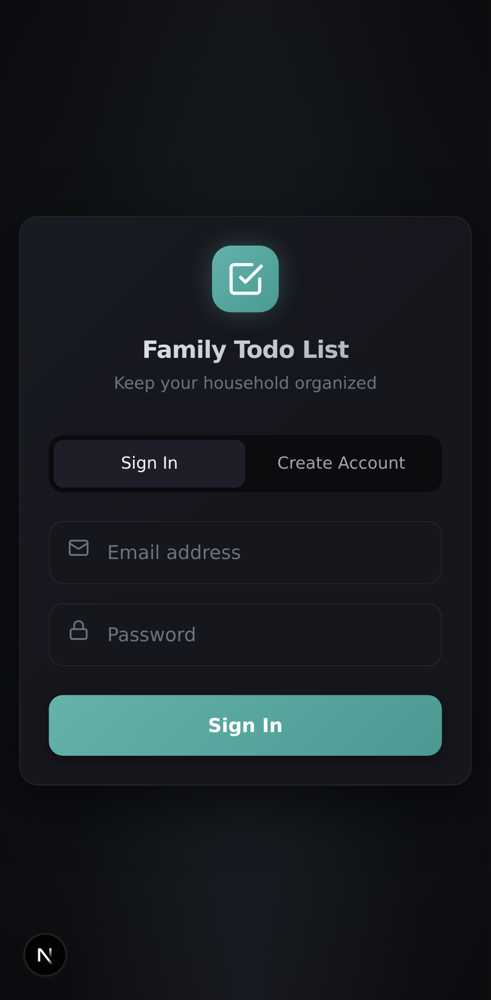
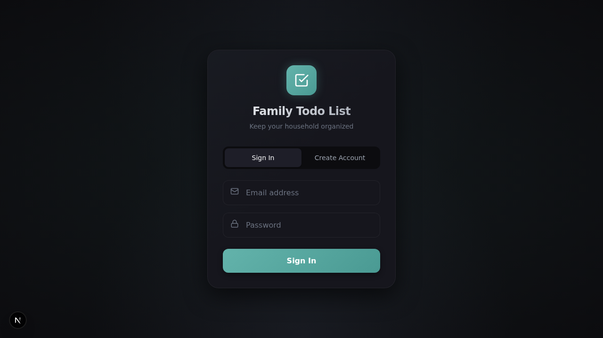

# Todo List App

Self-hosted shopping and meal planning application with voice input, recipe management, pantry tracking, and LLM-powered auto-categorization.

## Screenshots

<p align="center">
  
  
</p>

*Modern dark theme with teal accents, designed for mobile-first use*

## Features

### Shopping Lists
- **Multiple Lists**: Organize shopping by store (grocery, hardware, etc.)
- **Categories**: Group items by aisle/department with drag-and-drop reordering
- **Smart Merging**: Duplicate items automatically merge with quantity tracking
- **Real-Time Sync**: SSE-based multi-device synchronization

### Voice Input
- **Web Speech API**: Browser-native speech recognition
- **Natural Language Processing**: Add multiple items in one sentence
- **Confirmation Flow**: Review and edit parsed items before adding
- **Browser Support**: Chrome, Edge, Safari, and Brave (Android only). Brave on desktop does not support Web Speech API due to privacy restrictions.

### Recipe Management
- **Recipe Library**: Store recipes with ingredients and instructions
- **Smart Shopping**: Add recipe ingredients to shopping lists with one click
- **Store Preferences**: Remember which store to buy each ingredient from
- **Pantry Integration**: Skip ingredients you already have
- **Recipe Labels**: Color-coded tags show which recipe each item is for
- **Undo Support**: Easily undo recipe additions

### Pantry Tracking
- **Inventory Management**: Track what you have on hand
- **Recipe Matching**: LLM-powered matching of pantry items to recipe ingredients
- **Quick Add to List**: One-click button to add missing pantry items to shopping lists

### AI-Powered Features
- **Auto-Categorization**: Items automatically assigned to categories based on history
- **Learning System**: Categorization improves over time from your corrections
- **Ingredient Matching**: Smart matching between pantry items and recipe ingredients

### Progressive Web App
- **Installable**: Add to home screen on mobile devices
- **Offline Support**: Basic functionality works without internet
- **Push Notifications**: Optional alerts for shared list updates

## Tech Stack

- **Backend**: FastAPI + SQLAlchemy + PostgreSQL + Celery + Redis
- **Frontend**: Next.js 16 with App Router and React 19
- **LLM**: Ollama (gemma3:12b)
- **Infrastructure**: Docker Compose
- **External Access**: Cloudflare Tunnel (optional)

## Quick Start

### Prerequisites

- Docker and Docker Compose
- Ollama installed on host with gemma3:12b model
- Node.js 20+ (for PWA development)

### Setup

1. Clone and enter directory:
```bash
cd /path/to/todo-list
```

2. Copy environment file and configure:
```bash
cp .env.example .env
# Edit .env with your settings (JWT_SECRET, etc.)
```

3. Start services:
```bash
docker compose up -d
```

4. Run database migrations:
```bash
docker compose exec api alembic upgrade head
```

5. Access the application:
   - PWA: http://localhost:3002
   - API: http://localhost:8000
   - API Docs: http://localhost:8000/docs

## Development

### Database Migrations

Create a new migration:
```bash
docker compose exec api alembic revision --autogenerate -m "description"
```

Apply migrations:
```bash
docker compose exec api alembic upgrade head
```

Rollback:
```bash
docker compose exec api alembic downgrade -1
```

### Running Tests

```bash
docker compose exec -T api pytest --tb=short -q
```

### Testing Ollama Connection

```bash
curl http://localhost:11434/api/tags
```

Should show gemma3:12b in the list of models.

## Project Structure

```
todo-list/
├── src/                    # Python backend
│   ├── api/                # FastAPI endpoints
│   ├── models/             # SQLAlchemy models
│   ├── schemas/            # Pydantic schemas
│   ├── services/           # Business logic
│   └── tasks/              # Celery tasks
├── web/                    # Next.js PWA
│   ├── src/app/            # App Router pages
│   │   ├── lists/          # Shopping lists
│   │   ├── list/[id]/      # List detail view
│   │   ├── recipes/        # Recipe management
│   │   ├── pantry/         # Pantry tracking
│   │   ├── confirm/        # Voice confirmation
│   │   └── login/          # Authentication
│   └── src/lib/            # API client and utilities
├── alembic/                # Database migrations
└── docker-compose.yml      # Service orchestration
```

## Environment Variables

Key environment variables (see `.env.example` for full list):

- `DATABASE_URL`: PostgreSQL connection string
- `REDIS_URL`: Redis connection string
- `OLLAMA_BASE_URL`: Ollama API URL (default: http://host.docker.internal:11434)
- `LLM_MODEL`: Ollama model to use (default: gemma3:12b)
- `JWT_SECRET`: Secret key for JWT tokens (generate with: `openssl rand -hex 32`)

## License

MIT
