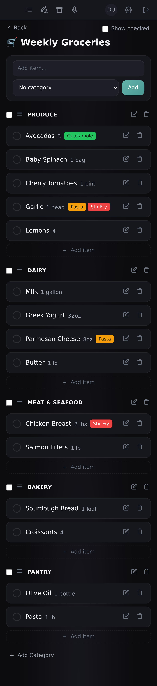
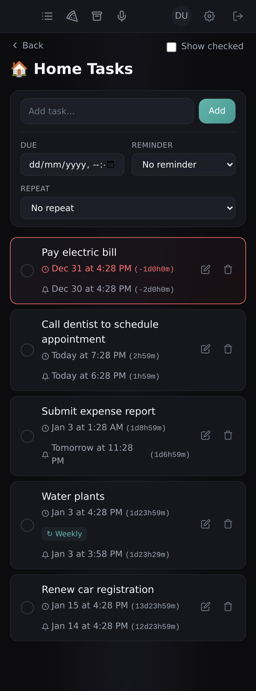
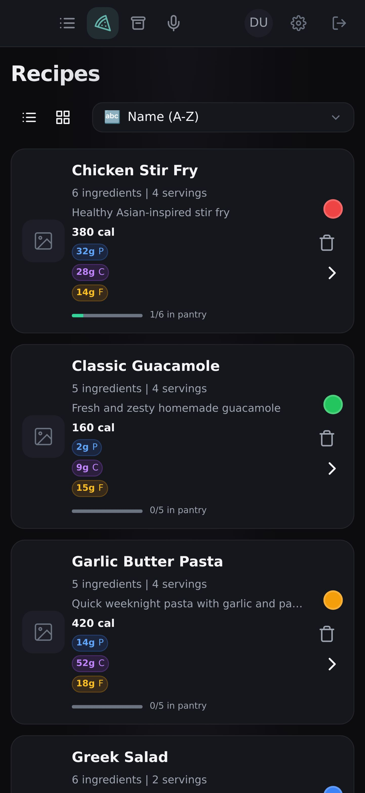
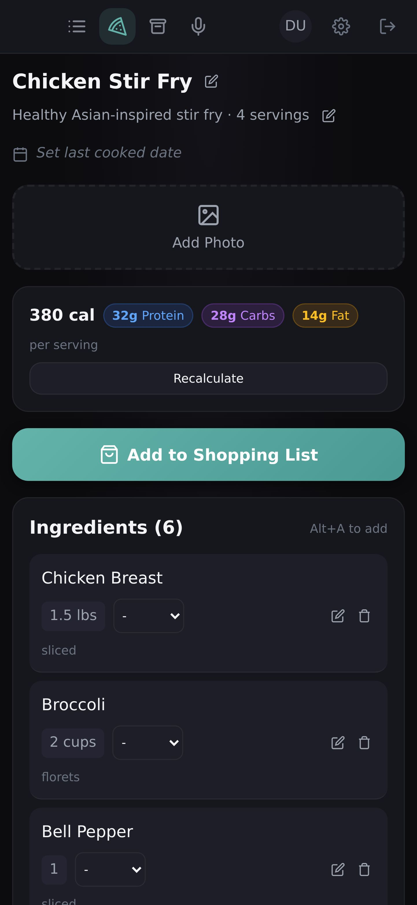
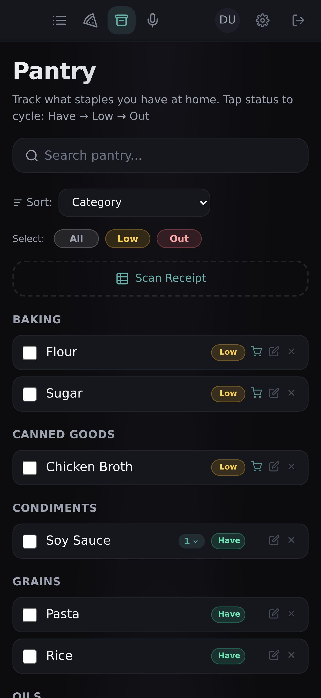

# Todo List App

Self-hosted shopping and meal planning app with voice input, recipe management, pantry tracking, task reminders, and LLM-powered auto-categorization.

## Screenshots

<p align="center">
  
  
  
</p>
<p align="center">
  
  
  
</p>

*Dark theme with teal accents, mobile-first PWA design*

## Features

### Shopping Lists
- **Multiple Lists**: Organize by store (grocery, hardware, etc.)
- **Categories**: Group items by aisle with drag-and-drop reordering
- **Smart Merging**: Duplicates auto-merge with quantity tracking
- **Real-Time Sync**: SSE-based multi-device synchronization
- **List Sharing**: Share lists with household members (view/edit/admin permissions)

### Task Lists
- **Due Dates**: Set deadlines for tasks
- **Reminder Escalation**: Push notification → SMS (5min) → voice call (15min)
- **Recurrence**: Set repeating patterns for recurring tasks
- **Quiet Hours**: Respect do-not-disturb windows

### Voice Input
- **Web Speech API**: Browser-native speech recognition
- **Natural Language**: Add multiple items in one sentence ("milk, eggs, and bread")
- **Confirmation Flow**: Review parsed items before adding
- **Real-Time Status**: See in-progress voice jobs on confirmation page

### Recipe Management
- **Recipe Library**: Store ingredients, instructions, and images
- **Image Upload**: Add photos to recipes (auto-resized with thumbnails)
- **Smart Shopping**: Add recipe ingredients to lists with one click
- **Pantry Integration**: Auto-skip ingredients you already have
- **Recipe Labels**: Color-coded badges show which recipe each list item is for
- **"Ready to Cook" Sort**: Sort recipes by pantry ingredient coverage
- **Last Cooked Tracking**: Track when you last made each recipe
- **Undo Support**: Easily undo recipe additions

### Pantry Tracking
- **Inventory Management**: Track what you have on hand
- **Recipe Participation**: See which recipes use each pantry item
- **LLM Matching**: Smart matching between pantry items and recipe ingredients
- **Quick Add**: One-click to add low/missing items to shopping lists

### Household Sharing
- **Shared Recipes & Pantry**: Users who share lists automatically share recipes and pantry
- **Permission Levels**: View, edit, or admin access per list

### AI-Powered Features
- **Auto-Categorization**: Items assigned to categories based on history
- **Learning System**: Improves from your corrections over time
- **Voice Parsing**: Natural language understanding via local LLM
- **Ingredient Matching**: Smart pantry-to-recipe matching

### Progressive Web App
- **Installable**: Add to home screen on mobile
- **Offline Support**: Basic functionality without internet
- **Fast Loading**: Client-side caching for snappy navigation

## Tech Stack

- **Backend**: FastAPI + SQLAlchemy + PostgreSQL + Celery + Redis
- **Frontend**: Next.js (App Router) + React
- **LLM**: Ollama (qwen2.5:7b)
- **Notifications**: Twilio (SMS/voice) + Web Push
- **Infrastructure**: Docker Compose
- **External Access**: Cloudflare Tunnel (optional)

## Quick Start

### Prerequisites

- Docker and Docker Compose
- Ollama with `qwen2.5:7b` model (`ollama pull qwen2.5:7b`)

### Setup

```bash
# Configure environment
cp .env.example .env
# Edit .env: set JWT_SECRET (openssl rand -hex 32), Twilio creds if using reminders

# Start services
docker compose up -d

# Run migrations
docker compose exec api alembic upgrade head
```

Access at:
- **App**: http://localhost:3002
- **API Docs**: http://localhost:8000/docs

## Environment Variables

Key variables (see `.env.example` for full list):

| Variable | Description |
|----------|-------------|
| `JWT_SECRET` | Secret for JWT tokens (`openssl rand -hex 32`) |
| `OLLAMA_BASE_URL` | Ollama API (default: `http://host.docker.internal:11434`) |
| `LLM_MODEL` | Model name (default: `qwen2.5:7b`) |
| `TWILIO_*` | Twilio credentials for SMS/voice reminders |
| `VAPID_*` | VAPID keys for web push notifications |

## Development

See `CLAUDE.md` for development commands, architecture details, and code conventions.

## License

MIT
